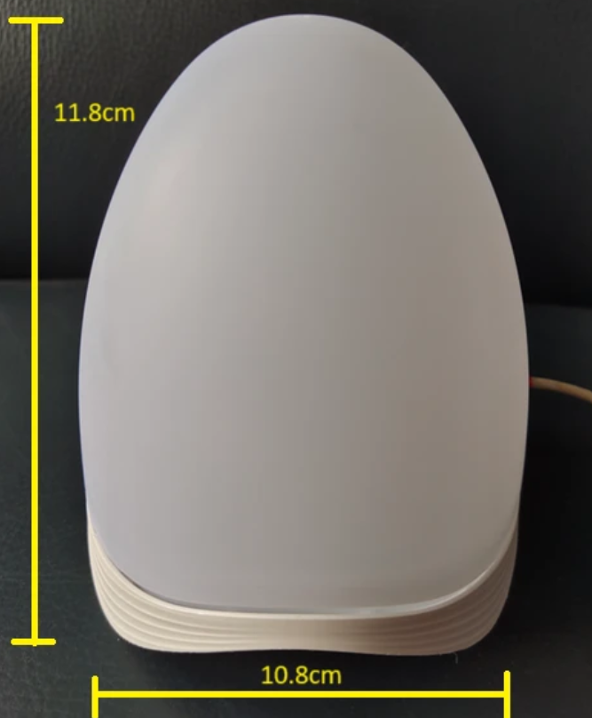
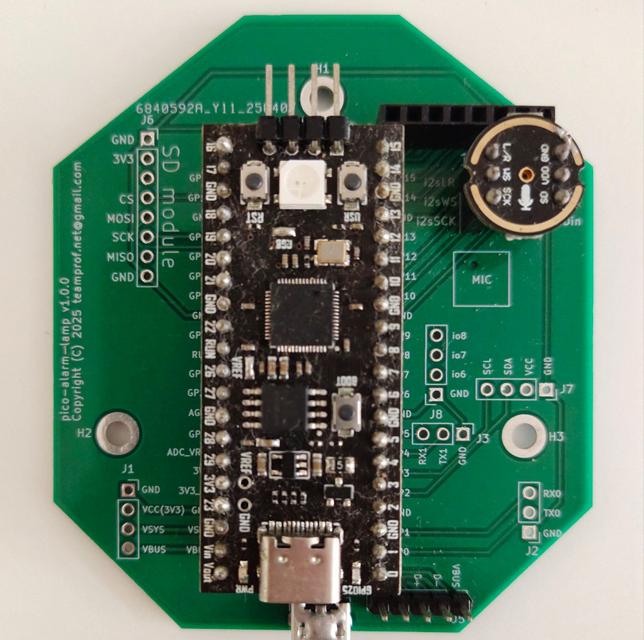
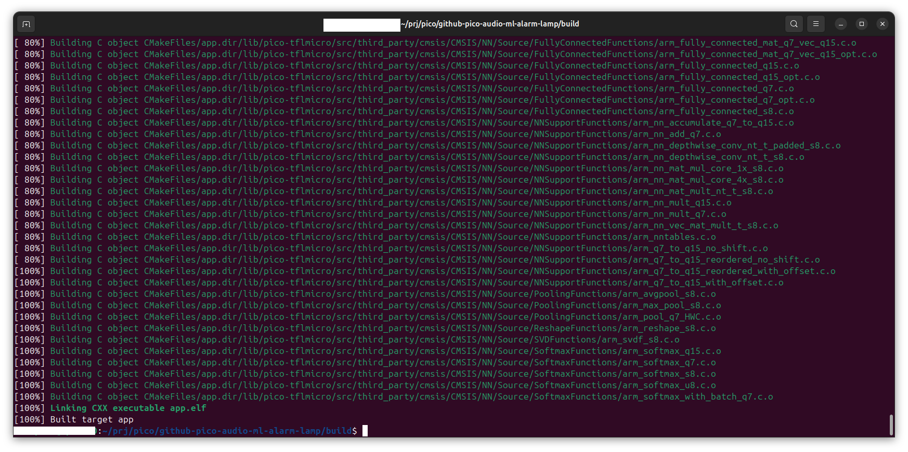
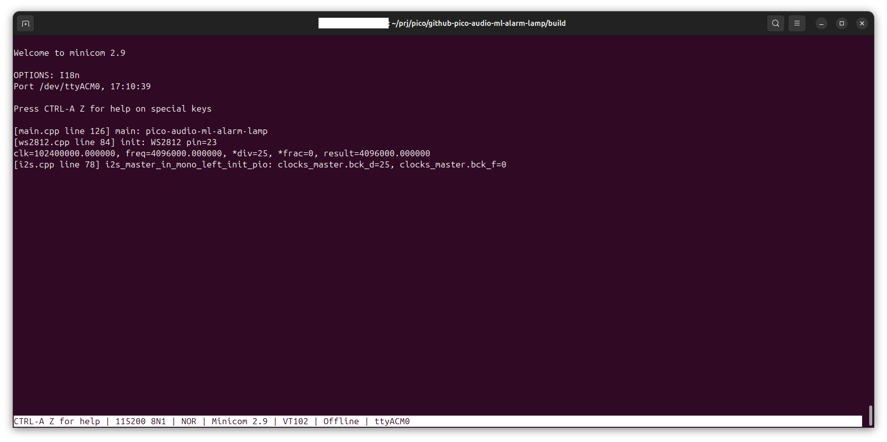
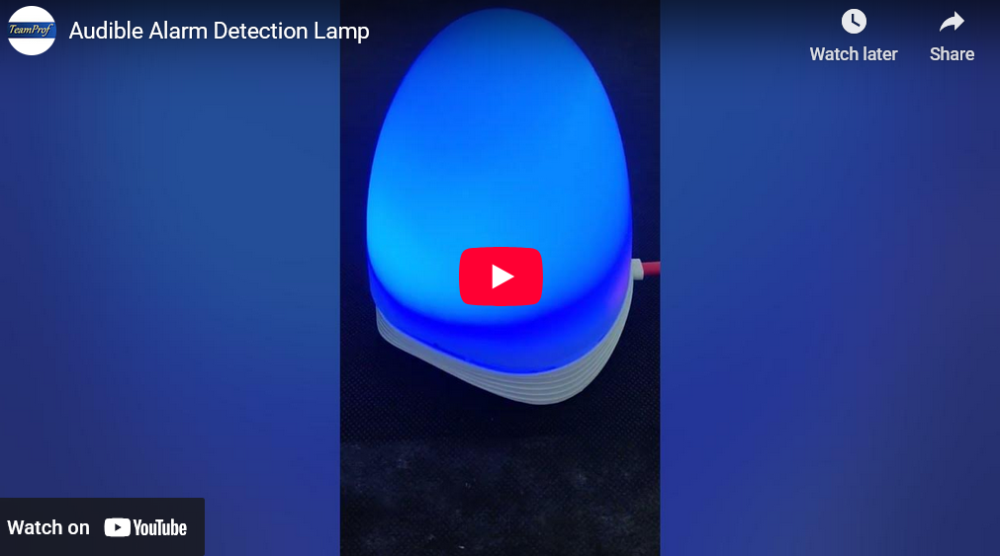
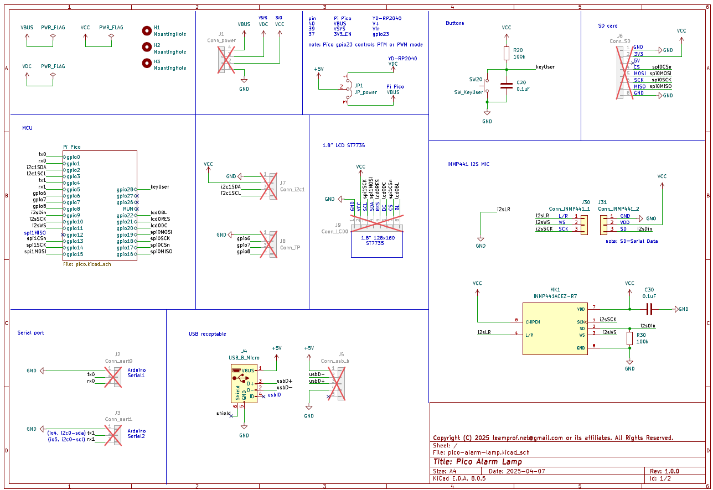
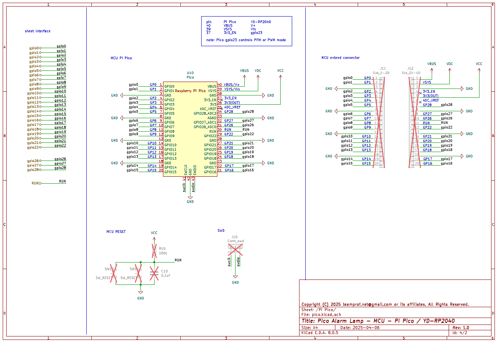

# Pico Audio ML Alarm Lamp
This project showcases an RP2040-based audio machine learning device designed for alarm detection and adaptive lamp color control. Under normal operation, the lamp emits blue light, but automatically switches to red when an alarm is detected.

## Introduction
Detecting alarm sounds is critically important for people who are deaf or hard of hearing because traditional auditory alerts, such as fire alarms, smoke detectors, or emergency sirens, may go unnoticed and put them at significant risk.

This Audible Alarm Detection Lamp enhances safety by detecting alarm sounds through advanced acoustic sensors. It transforms audible alerts into visual signals, red light, providing a vital layer of awareness for the hearing-impaired or others in noisy environments.

During normal operation, the lamp's color is set to blue. When an alarm sound is detected, its color automatically changes to red. 

The lamp is powered via USB, ensuring ease of connectivity with laptops, power banks, or USB adapters. It is a compact, portable, and energy-efficient lamp, making it an ideal accessory for enhancing your workspace or home environment.

[](https://github.com/teamprof/ohw-pico-w5100s-audio-aiot/blob/main/LICENSE)

<a href="https://www.buymeacoffee.com/teamprof" target="_blank"></a>


---
## Hardware
The following components are required for this project:
- pico-alarm-lamp v1.0.0 PCB 
- YD-RP2040
- TDK InvenSense INMP441
- PC with Pico C SDK v2.1.1 installed
- an audio device to generate fire alarm sound

---
## Photo
[](https://github.com/teamprof/pico-audio-ml-audio-lamp/blob/main/doc/image/product-img.png)  
Purchase your DIY kit at USD 25 (plus tax and freight) — [contact us](mailto:teamprof.net@gmail.com) to order.  
Lead time: one month after payment is received.

DIY kit includes
| Item                        | qty (pcs) |
|-----------------------------|-----------|
| plastic enclosure           |     1     |
| pico-alarm-lamp PCB         |     1     |
| YD-RP2040                   |     1     |
| TDK INMP441 module          |     1     |
| 20-pin 2.54mm pitch header  |     2     |
| 20-pin 2.54mm pitch socket  |     2     |
| 3-pin 2.54 pitch header     |     2     |
| 3-pin 2.54 pitch socket     |     2     |

---
## Device Block Diagram
```
    ┌───────────────────┐
    │     YD-RP2040     │
    ├──────────┬────────┤     
    │  RP2040  │ WS2812 │
    └─────▲────┴────────┘     
          |(I2S)         
    ┌─────┴─────┐  
    │  INMP441  │   
    └───────────┘  
```
## PCB Assembly
- Solder a pair of 20‑pin sockets to the PCB at the U1 position
- Solder a pair of 3‑pin sockets to the PCB at the J30 and J31 position
- Solder a pair of 20‑pin header on the YD-RP2040 board
- Solder a pair of 3‑pin header on the INMP441 module
- Mount the soldered YD‑RP2040 on the PCB at the designated U1 location
- Mount the soldered INMP441 module on the PCB at the designated J30 and J30 locations
- Ensure the final PCBA is assembled as depicted in the figure below
[](https://github.com/teamprof/pico-audio-ml-audio-lamp/blob/main/doc/image/pcba-small.png)

---
## Build firmware
- Open a terminal in Ubuntu and run the following commands:
```
git clone https://github.com/teamprof/pico-audio-ml-alarm-lamp.git 
cd pico-audio-ml-alarm-lamp
git clone --branch 2.1.1 https://github.com/raspberrypi/pico-sdk.git
cd pico-sdk
git submodule init
git submodule update
export PICO_SDK_PATH="$(pwd)/sdk/2.1.1"
export PICO_BOARD=pico
cd ..
mkdir -p build && cd build
cmake .. -DPICO_BOARD=${PICO_BOARD}
make -j4

```
- If everything goes smoothly, you should see the following screen.
[](https://github.com/teamprof/pico-audio-ml-alarm-lamp/blob/main/doc/image/screen-build.png)
- Hold down the onboard BOOT button and connect it to your computer via USB to enter USB boot mode
- Copy the app.uf2 under the build folder to YD-RP2040 (RPI-RP2)
- On Ubuntu, launch Minicom by typing "minicom -b 115200 /dev/ttyACM0" in the terminal, and click the onboard RESET button  
If everything goes smoothly, you should see the following screen.
[](https://github.com/teamprof/pico-audio-ml-alarm-lamp/blob/main/doc/image/screen-run.png)
- The onboard WS2812 LED should light up blue.
- Generate an alarm sound with an audio output device, the onboard WS2812 LED should light up red.

---
## Video demo
The lamp displays blue during normal operation and switches to red when an alarm is active.
[](https://youtube.com/shorts/H2cvId9s4hk) 

## Schematic
[](https://github.com/teamprof/pico-audio-ml-audio-lamp/blob/main/doc/image/pico-alarm-lamp-sch-v1.0.0.pdf)
[](https://github.com/teamprof/pico-audio-ml-audio-lamp/blob/main/doc/image/pico-alarm-lamp-sch-v1.0.0.pdf)

## License
- The project is licensed under GNU GENERAL PUBLIC LICENSE Version 3

## Copyright
- Copyright 2025 teamprof.net@gmail.com. All rights reserved.


